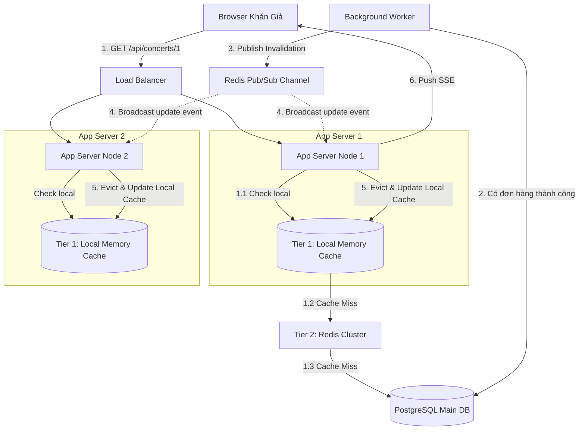
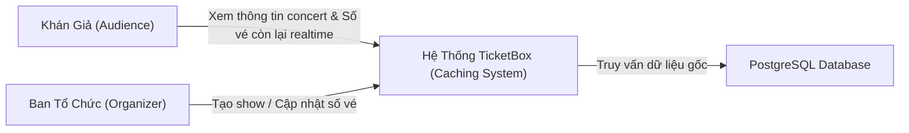
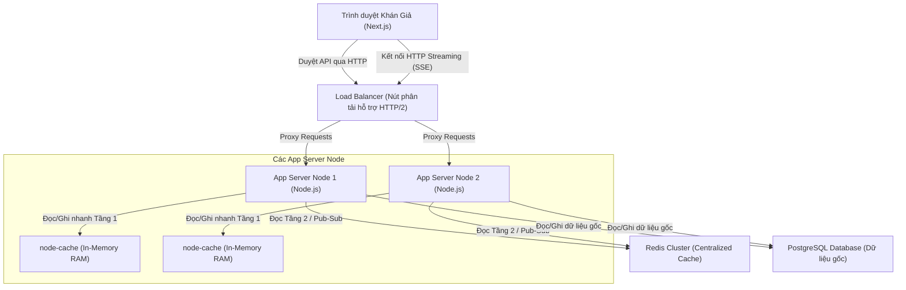
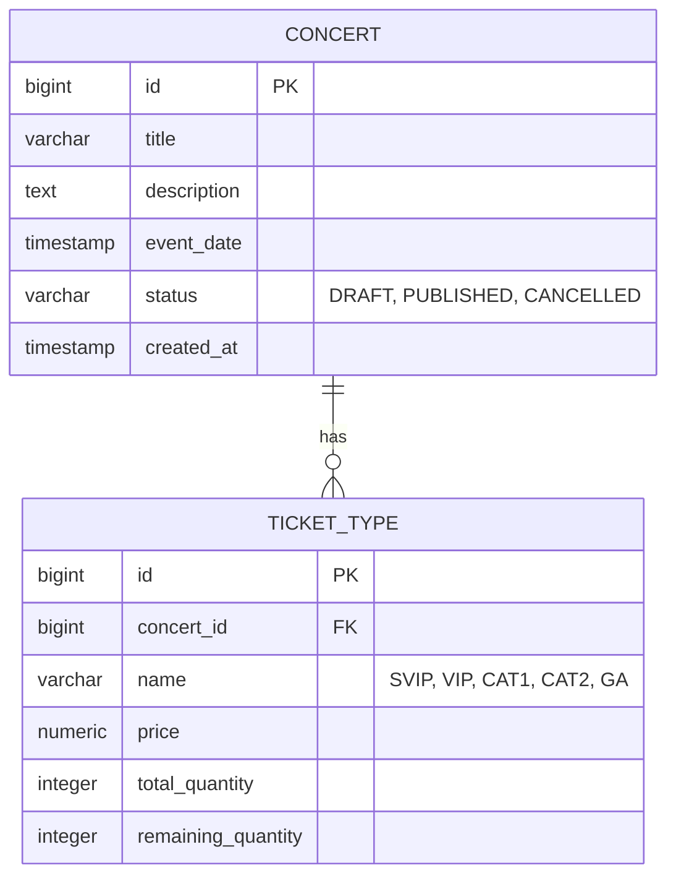

# TicketBox Caching — Technical Design

Tài liệu này đặc tả kiến trúc kỹ thuật của hệ thống Caching tối ưu thuộc dự án TicketBox, tập trung vào việc giải quyết bài toán tải cao (80.000 user concurrent) và đồng bộ số lượng vé thời gian thực dựa trên **Phương án 3: Hybrid Caching (Two-Tier Cache + SSE)**.

---

## 1. Kiến trúc tổng thể (Architectural Overview)
Kiến trúc Caching của TicketBox được thiết kế theo mô hình **Cache Phân Tầng (Two-Tier Cache)** kết hợp với cơ chế **Đẩy dữ liệu chủ động (Server-Sent Events - SSE)** để đảm bảo khả năng chịu tải cực cao và tính nhất quán dữ liệu ở thời gian thực.



### Các thành phần tham gia:
1.  **Client (Browser):** Thiết lập kết nối SSE (`EventSource`) một chiều để nhận biến động số vé thời gian thực. Gửi các request đọc thông tin show thông thường qua HTTPS.
2.  **App Server (Node.js/Express Cluster):** Nơi xử lý logic. Mỗi instance chứa một vùng **Local In-Memory Cache (Tier 1)** độc lập.
3.  **Tier 1 (In-Memory Cache):** Nằm ngay trong bộ nhớ RAM của từng App Server (dùng thư viện `node-cache` hoặc map object). Giảm thiểu tối đa việc phải thực hiện các kết nối mạng (Network I/O) ra bên ngoài.
4.  **Tier 2 (Redis Cluster):** Tầng cache tập trung và có tính nhất quán cao hơn. Đóng vai trò là "Single Source of Truth" cho tầng Cache.
5.  **Redis Pub/Sub Channel:** Kênh truyền tin nội bộ để đồng bộ việc xóa/cập nhật cache giữa các App Server chạy song song.
6.  **Database (PostgreSQL):** Cơ sở dữ liệu gốc lưu trữ thông tin Concert và Ticket Types chính xác tuyệt đối.

---

## 2. C4 Diagram (Tập trung vào Caching)

### Level 1 — System Context
Thể hiện mối liên hệ giữa các tác nhân và hệ thống TicketBox liên quan đến chức năng xem thông tin/trạng thái vé.



### Level 2 — Container
Phân rã các thành phần bên trong hệ thống TicketBox phục vụ cho kiến trúc Caching.



---

## 3. Thiết kế Cơ sở dữ liệu tối giản (Database Schema)
Để phục vụ việc lưu trữ thông tin concert và số vé gốc, hệ thống sử dụng PostgreSQL với các bảng được chuẩn hóa:



### Chi tiết Schema:
*   **Bảng `concerts`**: Lưu thông tin tĩnh của show diễn. Dữ liệu này ít khi thay đổi nên sẽ được cache rất lâu.
*   **Bảng `ticket_types`**: Lưu thông tin giá vé và số lượng vé còn lại (`remaining_quantity`). Dữ liệu này biến động liên tục khi có giao dịch và cần được đồng bộ cực nhanh lên tầng Cache.

---

## 4. Thiết kế Kỹ thuật Chi tiết: Hybrid Caching (Two-Tier)
Hệ thống kết hợp 2 tầng cache để tối ưu hóa hiệu năng:

### Tầng 1: Local In-Memory Cache (RAM cục bộ tại mỗi App Node)
*   **Công nghệ:** Sử dụng thư viện `node-cache` (đối với Node.js) chạy trực tiếp trong RAM của tiến trình.
*   **Chính sách TTL (Time-To-Live):**
    *   Thông tin Concert tĩnh: **TTL = 5 phút** (300 giây).
    *   Số lượng vé còn lại: **TTL = 1 giây**.
*   **Ý nghĩa:** Khi 80.000 user cùng F5 hoặc kết nối liên tục, thay vì 80.000 request đập vào Redis, mỗi App Server chỉ gửi tối đa **1 request/giây** đến Redis để cập nhật lại số lượng vé. Nếu có 30 App Server, Redis Cluster chỉ phải chịu **30 req/s** - một tải trọng cực kỳ nhẹ nhàng.

### Tầng 2: Centralized Cache (Redis Cluster tập trung)
*   **Công nghệ:** Redis Cluster đảm bảo phân tán dữ liệu và tính sẵn sàng cao.
*   **Quy ước Key:**
    *   Thông tin Concert: `concert:{concert_id}:info` (TTL = 1 giờ).
    *   Số lượng vé còn lại: `concert:{concert_id}:tickets` (Hash key lưu `{ticket_type_id}: {remaining_qty}`). Không đặt TTL (vô hạn) vì Redis đóng vai trò là single source of truth cho số lượng vé trong suốt thời gian mở bán.

### Cơ chế Invalidation & Push thời gian thực (Redis Pub/Sub + SSE)
Khi có giao dịch mua vé thành công, hệ thống không đợi 1 giây TTL của Local Cache hết hạn mà thực hiện đồng bộ chủ động:

```
[MUA VÉ THÀNH CÔNG]
       │
       ▼
1. Trừ số lượng vé trên RAM Redis Cluster (Tầng 2) trước.
   Nếu thành công (còn vé), đẩy message "Đơn hàng" vào Message Queue (RabbitMQ) và nhả kết nối.
       │
       ▼
2. Background Worker lấy message từ Queue và cập nhật dữ liệu gốc vào PostgreSQL (Asynchronous Write).
       │
       ▼
3. Worker phát một message lên kênh Redis Pub/Sub: `{"concert_id": "1", "ticket_type_id": "A", "remaining": 198}`.
       │
       ▼
4. Tất cả các App Server Node đăng ký kênh này lập tức nhận được message:
   ├── Xóa dữ liệu cũ trong RAM cục bộ (Local Cache Tầng 1).
   └── Ghi đè con số mới `198` vào Local Cache ngay lập tức.
       │
       ▼
5. Các App Server chủ động đẩy (push) sự thay đổi này xuống trình duyệt của khách hàng 
   đang xem show qua đường ống SSE (Server-Sent Events) đang duy trì.
       │
       ▼
6. Trình duyệt nhận sự kiện và cập nhật trực tiếp lên UI (Số lượng vé tự động giảm từ 200 -> 198).
```

---

## 5. Phân tích các Kịch bản Lỗi (Resilience Design)

### Kịch bản 1: Redis Cluster trung tâm bị mất kết nối (Redis Down)
*   **Ảnh hưởng:** Không thể lấy dữ liệu từ Tầng 2, nguy cơ gây sập PostgreSQL do toàn bộ App Server quay về đọc DB gốc.
*   **Giải pháp xử lý (Fallback):**
    *   Khi phát hiện lỗi kết nối Redis, App Server tự động kích hoạt **Graceful Degradation**.
    *   Tự động tăng TTL của Local Cache (Tầng 1) đối với số lượng vé từ **1 giây lên 10 giây**.
    *   Trong 10 giây này, tất cả user kết nối tới App Node đó đều đọc dữ liệu cũ lưu trong RAM cục bộ. Hệ thống chấp nhận dữ liệu hiển thị bị trễ 10 giây nhưng **tuyệt đối không để DB bị quá tải**.
    *   Ghi log cảnh báo mức CRITICAL để quản trị viên can thiệp hệ thống Redis.

### Kịch bản 2: Đường truyền mạng nội bộ bị lag khiến tin nhắn Pub/Sub bị mất
*   **Ảnh hưởng:** Một hoặc một vài App Server không nhận được lệnh xóa Local Cache, dẫn đến hiển thị số vé bị lệch (Stale Data) quá 1 giây.
*   **Giải pháp xử lý:** Nhờ cơ chế TTL cứng của Tầng 1 là **1 giây**, ngay cả khi không nhận được Pub/Sub message, Local Cache cục bộ của App Node đó cũng sẽ tự hết hạn sau tối đa 1 giây. Khi đó, request tiếp theo sẽ chủ động gọi lên Redis lấy số lượng mới nhất. Lệch dữ liệu tối đa chỉ giới hạn trong **1 giây**.

### Kịch bản 3: Kết nối SSE của Client bị ngắt đột ngột
*   **Ảnh hưởng:** Khán giả không nhận được cập nhật nhảy số realtime nữa.
*   **Giải pháp xử lý:** Phía Client cấu hình tự động reconnect với cơ chế **Exponential Backoff**. Khi kết nối lại thành công, client thực hiện gọi API `GET /api/concerts/1` một lần để đồng bộ lại trạng thái vé mới nhất.

---

## 6. Các Quyết định Kiến trúc Quan trọng (ADR)

### ADR-01: Lựa chọn Server-Sent Events (SSE) thay vì WebSockets để cập nhật realtime
*   **Quyết định:** Sử dụng SSE (HTTP Streaming) thay thế cho WebSockets để đẩy số lượng vé còn lại xuống Browser.
*   **Lý do:** 
    *   Yêu cầu nghiệp vụ ở đây là **một chiều (unidirectional)**: chỉ cần Server đẩy số lượng vé biến động xuống cho client xem. Client không cần gửi dữ liệu ngược lại.
    *   SSE chạy trên giao thức HTTP tiêu chuẩn, tự động hỗ trợ cơ chế Reconnect, dễ dàng cấu hình qua Nginx Load Balancer hơn WebSockets.
    *   Độ phức tạp lập trình và tài nguyên kết nối của SSE nhẹ hơn WebSockets rất nhiều dưới tải lớn.

### ADR-02: Lựa chọn mô hình Cache Phân Tầng (Two-Tier) thay vì Cache-Aside Redis đơn thuần
*   **Quyết định:** Bắt buộc áp dụng Local Cache (RAM của App Server) làm Tầng 1 đứng trước Redis.
*   **Lý do:** 
    *   Nếu chỉ dùng Redis tập trung, khi 80.000 user cùng truy cập trong 1 phút, Redis Cluster vẫn phải nhận 80.000 request/giây từ các App Server. Con số này có thể làm nghẽn băng thông mạng nội bộ của cụm Server.
    *   Việc chặn request ngay tại RAM của mỗi App Node giúp giải phóng hoàn toàn băng thông mạng nội bộ và giảm tải cho Redis xuống gần như bằng 0 (chỉ còn vài chục request/giây).
